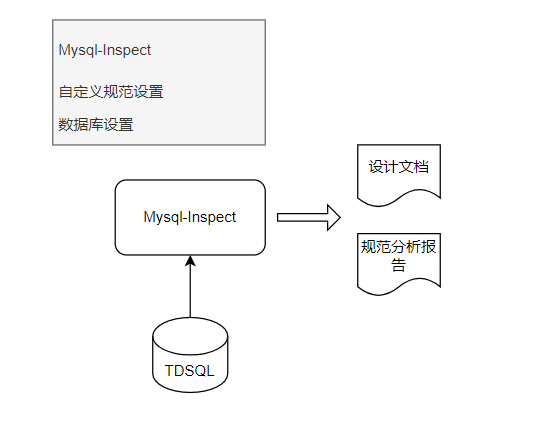
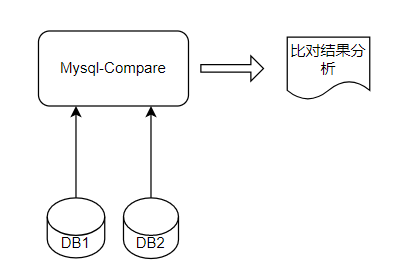

## Mysql-Utils

概述：

Mysql-Utils 是基于TDSQL开发的一款工具，融合了 Mysql-Inspect 和Mysql-Compare功能，旨在辅助和指导数据库、表结构和字段的设计工作。各个部门或者团队针对数据库、表等的设计均有一定的规范，本工具支持自定义规范的配置，并按照规范对开发人员设计的DDL语句执行结果进行校验，满足

- Mysql-Inspect 

  按照自定义设计规范，对数据库、表结构进行规范性校验，形成开发设计规范报告，根据设定的警告、错误性级别进行规范结果定级。

- Mysql-Compare
  
  提供多个数据库、表结构、索引等的比对功能，并支持数据库表结构文档的导出功能。鉴于各个项目组多套功能测试环境、演练环境、生产环境。对于管控比较弱的情况下，在版本追平方面，数据库追评经常是大家常常疏忽的。本工具基于多方库的比对，并

- Mysql-Analyze
  
  市面上，常见的MySQL可视化监控分析工具比如：MySQL Administrator，功能集中在服务器管理上，它可以帮助DBA把创建备份、创建用户并分配权限、显示服务器日志和状态信息等过程进行自动化处理。但是适合DBA使用，而不是开发人员和分析人员。

  基于可视化服务，通过采集性能模式数据，协助诊断问题；提供TDSQL运行状态分析，包括系统变量查看，统计DML语句执行信息，预警设置等。针对当前数据库运行情况可识别慢查询语句，无效索引，冗余索引等。本工具基于java平台开发，能灵活的使用在各种操作平台之上，它能详细的的监控出当前MYSQL和INNODB运行的状态，以便维护、开发设计人员根据结果合理的优化MYSQL，让MYSQL更稳定更高效的运行。

### Mysql-Inspect 

#### 架构图



基于配置的规范设计

```dotnetcli
mysql:
  ...
predicate:
  database:
    charset: 
      pre:
        level: warn
        rules:
          - utf8
          - utf8mb4
    engin:
      ...
  table:
    rowformat:
    ...
  column:
    flagLen: 
      ...
```

### Mysql-Compare

#### 架构图

