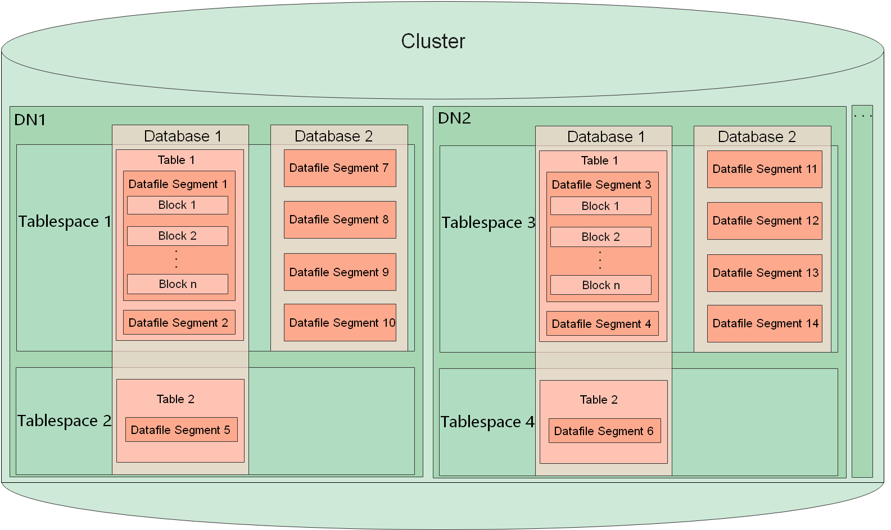
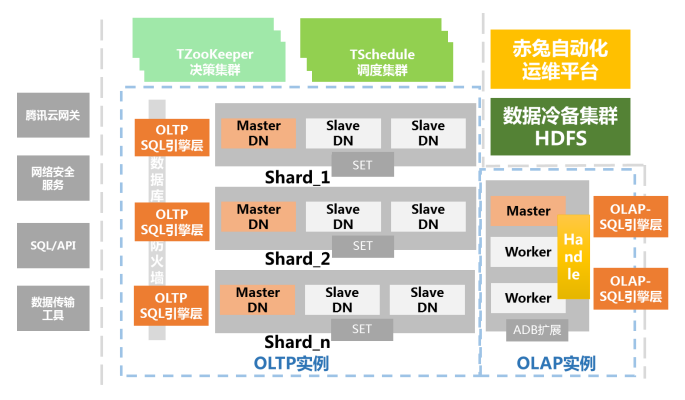

# TDSQL数据库设计规范调研

## 概述

数据库开发和设计是任何数据密集型项目的核心，这些项目几乎包含了所有业务应用程序。数据库设计规范用于指导各应用系统数据库的设计原则、数据库命名编写规范、数据库结构设计、数据库操作规范、数据存储规范、数据库运用、数据库性能设计、数据库外部设计、数据库版本控制、数据库安全性设计等方面内容，明确了应用系统数据库的安全性、完整性，并针对数据库进行外部设计、结构设计和运用设计，统一各应用系统的数据库设计和开发，为数据采集、数据存储、数据传输、数据共享和交互做好准备。

### 数据库规范的定义和分类

#### 数据库定义

TDSQL（Tencent Distributed SQL，TDSQL）
TDSQL 是腾讯打造的一款分布式数据库产品，具备强一致高可用、全球部署架构、分布式水平部署在腾讯云上的一种支持自动水平拆分、Shared Nothing 架构的分布式数据库。TDSQL MySQL版 即业务获取的是完整的逻辑库表，而后端会将库表均匀的拆分到多个物理分片节点。 部署主备架构，提供容灾、备份、恢复、监控、迁移等全套解决方案，适用于 TB 或 PB 级的海量数据库场景。
TDSQL MySQL版 提供不同的引擎供用户选择，两者均兼容 MySQL 标准协议：
- InnoDB 版采用 InnoDB 作为数据存储引擎，是 MySQL 的默认存储引擎。
- TDStore 版采用腾讯云自研的新敏态引擎 TDstore 作为数据存储引擎，该引擎可以有效解决客户业务发展过程中业务形态、业务量的不可预知性，适配金融敏态业务。

数据库 Database
按照概念结构组织的数据的汇集，它描述这些数据的特征及与数据对应的实体间的关系并支持一个或多个应用领域。

表 Table
数据的一种排列，其中每一项可通过变元或关键字标识。

https://www.nmpa.gov.cn/directory/web/nmpa/images/uL28jQgyv2+3biyei8xrnmt7ajqNX3xPS4rz7uOWjqS5wZGY=.pdf#page=7&zoom=100,90,113

https://pic.doit.com.cn/sdss2022/SDSSwhitepaper.pdf

视图 View
视图是原始数据库数据的一种变换，是查看表中数据的另外一种方式。可以将视图看成是一个移动的窗口，通过它可以看到感兴趣的数据。
视图是从一个或多个实际表中获得的，这些表的数据存放在数据库中。那些用于产生视图的表叫做该视图的基表。一个视图也可以从另一个视图中产生。

触发器 Trigger
触发器是一种特殊类型的存储过程，它不同于我们前面介绍过的存储过程。触发器主要是通过事件进行触发而被执行的，而存储过程可以通过存储过程名字而被直接调用。当对某一表进行诸如 UPDATE、INSERT、 DELETE 这些操作时，数据库会自动执行触发器所定义的 SQL 语句，从而确保对数据的处理必须符合由这些 SQL 语句所定义的规则。

索引 Index
索引是一个单独的、物理的数据库结构，它是某个表中一列或若干列值的集合和相应的指向表中物理标识这些值的数据页的逻辑指针清单。

存储过程 Storage process
存储过程是由流控制和 SQL 语句书写的过程，这个过程经编译和优化后存储在数据库服务器中，使用时只要调用即可。其中，若干个有联系的过程可以组合在一起构成程序包。

联机事务处理系统 On-Line transaction processing（OLTP）
联机事务处理系统(OLTP)，也称为面向交易的处理系统，其基本特征是原始数据可以立即传送到计算中心进行处理，并在很短的时间内给出处理结果。这样做的最大优点是可以即时地处理输入的数据，及时地回答。也称为实时系统 (Real time System)。衡量联机事务处理系统的一个重要性能指标是系统性能，具体体现为实时响应时间(Response Time)，即用户在终端上送入数据之后，到计算机对这个请求给出答复所需要的时间。

联机分析处理 On-Line Analysis Processing（OLAP）
联机分析处理是共享多维信息的、针对特定问题的联机数据访问和分析的快速软件技术。它通过对信息的多种可能的观察形式进行快速、稳定一致和交互性的存取，允许管理决策人员对数据进行深入观察。决策数据是多维数据，多维数据就是决策的主要内容。OLAP 专门设计用于支持复杂的分析操作，侧重对决策人员和高层管理人员的决策支持，可以根据分析人员的要求快速、灵活的进行大数据量的复杂查询处理，并且以一种直观而易懂的形式将查询结果提供给决策人员，以便他们准确掌握经营状况，了解对象的需求，制定正确的方案。

参照完整性 Referential integrity
参照完整性，简单的说就是表间主键外键的关系。参照完整性属于表间规则。对于永久关系的相关表，在更新、插入或删除记录时，如果只改其一不改其二，就会影响数据的完整性。例如：修改父表中关键字值后，子表关键字值未做相应改变；删除父表的某记录后，子表的相应记录未删除，致使这些记录成为孤立记录；对于子表插入的记录，父表中没有相应关键字值的记录，等等。对于这些设计表间数据的完整性，统称为参照完整性。

数据完整性 Data Integrity
数据完整性是指数据的精确性（Accuracy）和可靠性（Reliability）。它是应防止数据库中存在不符合语义规定的数据和防止因错误信息的输入输出造成无效操作或错误信息而提出的。数据完整性分为四类：实体完整性（Entity Integrity）、域完整性（Domain Integrity）、参照完整性（Referential Integrity）、用户定义的完整性（User-defined Integrity）。

#### 设计原则

概述
数据库设计（Database Design）是指根据用户的需求，在某一具体的数据库管理系统上，设计数据库的结构和建立数据库的过程，就是规划和结构化数据库中的数据对象以及这些数据对象之间关系的过程。数据库设计原则主要从规范化、数据完整性、分级设计、高内聚、低耦合、整体性、高效性几个方面进行阐述，是各应用系统数据库建设的基本要求和基本原则。所有数据库的建设应在满足上述原则的基础上，进行个性化的扩展设计。

设计规范化原则
对数据库的设计，完全采用 E-R 模型设计思想，并遵循关系数据库设计第三范式（3NF）标准要求。范式是数据库设计所需要满足的规范，满足这些规范的数据库是简洁的、结构明晰的，同时，不会发生插入（insert）、删除（delete）和更新（update）操作异常。数据库设计应遵循以数据库三范式为主导的设计原则，尽量保证数据的一致性、减少数据冗余。对于有较高性能及其它特殊要求的情况，可以考虑以“空间换时间”的设计方式。第三范式（3NF）要求一个数据库表中不包含已在其它表中已包含的非主关键字信息。

数据完整性原则
数据完整性是为防止数据库中存在不符合语义规定的数据和防止因错误信息的输入输出造成无效操作或错误信息而提出的，数据完整性确保了数据库中的信息不会被篡改。如果数据具有完整性，则表示数据有效（正确并且准确），而且数据库的关系结构是完整的。参照完整性约束可以加强数据库的关系结构，这些规则使数据在各个表之间保持一致。

数据安全性原则
数据库的安全性是指保护数据，防止非法用户使用数据库或合法用户非法使用数据库造成数据泄露、更改或破坏。
系统在设计时要充分考虑到数据安全性，不同权限的用户看到的数据是存在差异的，通过制定对数据库的各类操作的标准，建立具有统一的管理和控制功能，例如：即使是系统管理员也无法知道用户的口令，因此无法以用户的身份进行登录。

分级设计原则
a）需求分析阶段：综合并分析各个用户的应用需求。
b）概念设计阶段：形成独立于机器特点，独立于各个 DBMS 产品的概念模式(E-R 图)。
c）逻辑设计阶段：首先将 E-R 图转换成具体的数据库产品支持的数据模型，如关系模型，形成数据库逻辑模式，然后根据用户处理的要求、安全性的考虑，在基本表的基础上再建立必要的视图(View)，形成数据的外模式。
d）物理设计阶段：根据 DBMS 特点和处理的需要，进行物理存储安排，建立索引，形成数据库内模式。按照需求分析、概念设计、逻辑设计、物理设计四个过程进行设计，形成一个统一的、稳定的、可扩展、安全的数据库方案。

高内聚原则
将数据库中公共使用的基础数据元和数据集独立建立基础数据库，同一数据中心内以数据库授权等
形式访问基础库中的数据，避免重复设计和存储。对基础数据进行统一管理，保证数据的一致性。

低耦合原则
应用系统在数据库的设计上应该避免直接调用其它应用系统的数据库，对数据库进行独立建库和独立维护，降低因为其它应用系统数据库变更而引起的威胁，但要遵循统一的数据库规范和命名规则。
基础库的独立设计，同一数据中心内以数据库授权等形式访问基础库中的数据，而不是重复设计、存储。

#### 命名规范
基本命名规范
a）语言
命名宜使用拼音简写，不宜使用中文或者特殊字符。当出现对象名重名且不同类型对象时，宜加类型前缀或后缀以示区别。
b）大小写
名称宜大写，方便不同数据库移植，避免程序调用问题。
c）单词分隔
命名的各单词之间可以使用下划线进行分隔。
d）保留字
命名不宜使用 SQL 保留字。
e）命名长度
表名、字段名、视图名长度应限制在 20 个字符内(含前缀)。
f）字段名称
同一个字段名在一个数据库中只能代表一个意思。比如 telephone 在一个表中代表“电话号码”的意思，在另外一个表中就不能代表“手机号码”的意思。

数据库对象命名规范
a）表
1）实体（表）
前缀为系统标识，<系统标识>_<表标识>。
表标识建议为拼音简称。
2）属性（列）
COMP_CODE，字段名称应用字母开头，采用有特征含义的单词或缩写，不宜用双引号包含。
b）视图
前缀为 V_，v_[<系统标识>]_<视图标识>。
视图标识建议为拼音简称。
c）存储过程
前缀为 P_，p_[<系统标识>]_<存储过程标识>。
存储过程标识建议为拼音简称。
d）函数
前缀为 F_，f_[<系统标识>]_<函数标识>。
函数标识建议为拼音简称。
e）触发器
tr_<表标识>_<i,u,d 的任意组合>(after)；
ti_<表标识>_<i,u,d 的任意组合>(instead)。
f）自定义数据类型
ud_<自定义数据类型标识>_<数据类型>。
g）Default
Df_<Default 标识>。
h）Rule
ru_<Rule 标识>。
i）主键
前缀为 PK_，pk_<表标识>_<主键标识>。
j）外键
前缀为 FK_，fk_<表标识>_<主表标识>_<外键标识>。
k）索引
前缀为 IDX_，IDX_<表标识>_<构成的字段名>。如果复合索引的构成字段较多，则只包含第一个字
段，并添加序号。

#### 数据库设计

#### 数据库存储规范

数据存取层介于语言处理层和数据存储层之间。它向上提供单元组接口，即导航式的一次一个元组的存取操作，向下则以系统缓冲区的存储器接口作为实现基础。数据存取层的任务是：
a）提供一次一个元组的查找、插入、删除、修改等基本操作。
b）提供元组查找所循的存取路径以及对存取路径的维护操作。如对索引记录的查找、插入、删除、修改。
c）对记录和存取路径的封锁、解锁操作。
d）日志文件的登记和读取操作。
e）辅助操作。如扫描、合并/排序，其操作对象有关系、有序表、索引等。
为了完成上述功能，通常把存取层又划分为若干功能子系统加以实现。存储引擎

## 数据库规范与其他技术的关系

### 与系统的关系
针对不同类型数据库系统，应采用不同的操作系统以及不同的数据库部署方式，选择操作系统环境应考虑数据库系统的需求。
示例：
对于中小型数据库系统，采用 Linux 操作系统比较合适，对于数据库冗余要求负载均衡能力要求较高的系统，可以采用数据库的集群方法，集群节点数范围在 2—64 个。对于大型数据库系统，可以采用小型机系统。RAD5 适合只读操作的数据库，RAD1 适合 OLTP 数据库。

### 与存储的关系

数据库涉及的存储主要有两种，内存和磁盘。
#### 内存要求
不同的操作系统管理内存的能力不同，不同的数据库系统对内存的要求也不同，建议根据操作系统环境和数据库系统规模选择适当的数据库内存。
示例：
对于 Linux 操作系统下的数据库，由于在正常情况下对数据库内存的管理能力不超过 1.7GB。所以总的物理内存在 4GB 以下。数据库内存的大小为物理内存的 50%—75%。对于 64 位的小型系统，数据库内存的管理超过 2GB 的限制，数据库内存设计在一个合适的范围内：物理内存的 50%— 70%，当数据库内存过大的时候会导致内存分页，影响系统性能。
当物理内存在 2GB 以下的情况下，交换分区 swap 为物理内存的 3 倍，当物理内存>2GB 的情况下，swap 大小为物理内存的 1—2 倍，当物理内存>8GB 时，swap 交换区仅设置为 8GB 即可。

InnoDB 内存模型
InnoDB引擎在访问某个数据时，就会以页为单位，把数据所在的页所有数据，加载到内存中；然后在内存中读写数据。在读写数据之后，并没有立刻把整页所占的内存空间释放掉，而是将其缓存起来，将来再次访问该页面的时候，就会省去磁盘IO的读取开销了。

InnoDB引擎在数据库启动的时候，向操作系统申请了一片连续的内存，并起了个专业的名词“Buffer Pool”——缓存池。默认情况下Buffer Pool只有128M大小。可以通过配置参数，单位是byte(字节)。 128 M = 134 217 728 byte，256M = 268 435 456 byte。下限最小值是5M，低于5M一律按照5M大小。
页默认缓存大小和磁盘存储页的大小是一样，16kb。Buffer Pool不仅保存页数据，还要保存页的控制信息数据。控制信息与页数据是一一对应的。每个页的控制信息大小是808字节，innodb_buffer_pool_size并不包含页的控制信息，换算出来设置Buffer Pool大小，是页的整数倍值Val,加上这个值Val的5%。16kb * n +（16kb * n * 5%），这样就避免了buffer pool缓冲池碎片过大的问题，空间利用率较高。

MEMORY 内存模型
MEMORY 存储引擎不在磁盘上创建任何文件。表定义存储在 MySQL 数据字典中。
MEMORY 表具有以下特征:
MEMORY 表的空间以小块的形式分配。表对插入使用100% 动态哈希。不需要溢出区域或额外的密钥空间。空闲列表不需要额外的空间。删除的行将放入链接列表，并在向表中插入新数据时重用。MEMORY 表也没有通常与删除和在散列表中插入相关的问题。
MEMORY 表使用固定长度的行存储格式。变长类型(如 VARCHAR)使用固定长度存储。
MEMORY 表不能包含 BLOB 或 TEXT 列。
内存包括对 AUTO _ increment 列的支持。

MyISAM 表具有以下特征:

所有数据值首先以低字节存储。这使得数据机和操作系统是独立的。对二进制可移植性的唯一要求是计算机使用两个补码有符号整数和 IEEE 浮点格式。这些要求在主流机器中得到了广泛的应用。二进制兼容性可能不适用于嵌入式系统，因为嵌入式系统有时具有特殊的处理器。

首先存储低位数据并不会有明显的速度损失; 表行中的字节通常是未对齐的，按照倒序读取未对齐的字节只需要少量的处理。此外，与其他代码相比，服务器中获取列值的代码对时间并不重要。

所有数字键值首先以高字节存储，以便更好地进行索引压缩。

支持大文件的文件系统和操作系统支持大文件(最多63位文件长度)。

MyISAM 表中的行数限制为(232)2(1.844 e + 19)行。

每个 MyISAM 表的最大索引数为64。

每个索引的最大列数为16。

最大密钥长度为1000字节。这也可以通过更改源代码和重新编译来改变。对于长度超过250字节的密钥，将使用比默认值1024字节更大的密钥块。

当按照排序顺序插入行时(如使用 AUTO _ increment 列时) ，将对索引树进行拆分，以便高节点只包含一个键。这提高了索引树中的空间利用率。

支持对每个表的一个 AUTO _ increment 列进行内部处理。MyISAM 自动更新此列以执行 INSERT 和 UPDATE 操作。这使得 AUTO _ increment 列更快(至少10%)。序列顶部的值在删除后不会重新使用。(当 AUTO _ increment 列定义为多列索引的最后一列时，从序列顶部删除的值将重用。)AUTO _ increment 值可以用 ALTER TABLE 或 myisamchk 重置。

当将删除与更新和插入混合使用时，动态大小的行的碎片要少得多。这是通过自动组合相邻的已删除块和在删除下一个块时扩展块来实现的。

MyISAM 支持并发插入: 如果一个表在数据文件中间没有空闲块，那么可以在其他线程从该表读取数据的同时向其插入新行。由于删除行或更新动态长度行的数据比其当前内容更多，可能会出现空闲块。当所有空闲块用完(填写)时，未来的插入将再次并发。见第8.11.3节，“并发插入”。

通过 CREATE TABLE 的 DATA DIRECTORY 和 INDEX DIRECTORY 表选项，可以将数据文件和索引文件放在不同物理设备的不同目录中，以获得更高的速度。见13.1.20节“创建表语句”。

可以对 BLOB 和 TEXT 列进行索引。

在索引列中允许使用 NULL 值。每个键需要0到1个字节。

每个字符列可以有不同的字符集。参见第10章，字符集，排序规则，Unicode。

MyISAM 索引文件中有一个标志，指示表是否正确关闭。如果使用 MyISAM _ recover_options 系统变量集启动 mysqld，则在打开 MyISAM 表时会自动检查，并在表未正确关闭时进行修复。

如果使用 -- update-state 选项运行 myisamchk，则将表标记为 checked。Myisamchk -- 只快速检查那些没有这个标记的表。

Myisamchk ——分析部分钥匙和整个钥匙的存储统计数据。

Myisampack 可以包装 BLOB 和 VARCHAR 列。

#### 磁盘要求

系统将文件存储到磁盘上时，按柱面、磁头、扇区的方式进行，即最先是第1磁道的第一磁头下（也就是第1盘面的第一磁道）的所有扇区，然后，是同一柱面的下一磁头，……，一个柱面存储满后就推进到下一个柱面，直到把文件内容全部写入磁盘。

索引与磁盘的关系：
索引是帮助MySQL高效获取数据的排好序的数据结构，索引存储在文件里。对于不同的存储引擎，支持的索引数据结构不同，比如：InnoDB支持Hash索引、BTree索引，MyISAM
InnoDB存储引擎数据文件本身就是索引文件表数据文件本身就是按B+Tree组织的一个索引结构文件聚集索引-叶节点包含了完整的数据记录。Innodb建议使用与业务无关的自增ID作为主键，数据记录本身被存于主索引（一颗B+Tree）的叶子节点上。这就要求同一个叶子节点内（大小为一个内存页或磁盘页）的各条数据记录按主键顺序存放，因此每当有一条新的记录插入时，MySQL会根据其主键将其插入适当的节点和位置，如果页面达到装载因子（InnoDB默认为15/16），则开辟一个新的页（节点）。这样就会形成一个紧凑的索引结构，近似顺序填满。由于每次插入时也不需要移动已有数据，因此效率很高，也不会增加很多开销在维护索引上。

MyISAM存储引擎索引文件和数据文件是分离的，文章一开始也介绍了，数据.MYD+结构.frm+索引.MYI三个文件。

CSV 存储引擎
存储引擎使用逗号分隔值格式将数据存储在文本文件中。CSV 存储引擎总是编译到 MySQL 服务器中。要检查 CSV 引擎的源代码，请查看 MySQL 源代码发行版的 storage/CSV 目录。创建 CSV 表时，服务器创建一个纯文本数据文件，其名称以表名开头，并且具有。CSV 扩展。当您将数据存储到表中时，存储引擎会将数据以逗号分隔值格式保存到数据文件中。
创建一个 CSV 表还会创建一个相应的元文件，该文件存储表的状态和表中存在的行数。此文件的名称与扩展名为 CSM 的表的名称相同。

CSV 存储引擎的限制：
- CSV 存储引擎不支持索引。
- CSV 存储引擎不支持分区。
- 使用 CSV 存储引擎创建的所有表在所有列上都必须具有 notnull 属性。

ARCHIVE 存储引擎
创建 ARCHIVE 表时，存储引擎将创建名称以表名开头的文件。数据文件的扩展名为.ARZ 和 .ARN 文件可能出现在优化操作期间。如果没有请求 BLOB 列，ARCHIVE 引擎将忽略它们，并在读取时扫描它们。
**存储**
插入行时将对其进行压缩。ARCHIVE 引擎使用 zlib 无损数据压缩。您可以使用 OPTIMIZE TABLE 分析表并将其打包成较小的格式(有关使用 OPTIMIZE TABLE 的原因，请参阅本节后面的部分)。该引擎还支持 CHECK TABLE。有几种类型的插入可以使用:
- INSERT 语句只是将行推送到压缩缓冲区，并且该缓冲区根据需要刷新。插入到缓冲区中受到锁的保护。SELECT 强制发生刷新。
- 大容量插入只有在完成之后才可见，除非其他插入同时发生，在这种情况下可以看到部分插入。除非在加载时发生正常插入，否则 SELECT 决不会导致大容量插入的刷新。
**索引**
在检索时，行将根据需要解压缩; 没有行缓存。SELECT 操作执行一个完整的表扫描: 当发生 SELECT 时，它查找当前有多少行可用并读取该行数。以一致读取的方式执行 SELECT。注意，插入过程中大量的 SELECT 语句会降低压缩性能，除非只使用批量插入。为了实现更好的压缩，可以使用 OPTIMIZE TABLE 或 REPAIR TABLE。SHOW TABLE STATUS 报告的 ARCHIVE 表中的行数总是准确的。

BLACKHOLE 存储引擎
引擎就像一个“黑洞”，它接受数据，但是扔掉数据，而不存储数据。检索总是返回一个空的结果。创建 BLACKHOLE 表时，服务器将在全局数据字典中创建表定义。没有与该表关联的文件。

## 基于MySQL数据库设计规范市场状况

近些年来，数据在国民经济各个领域扮演着愈发重要的作用，其使用特点较之以往也发生了诸多变化，其趋势主要有几个方面。

随着8K、5G、IoT、大数据、AI等系列技术的发展，数据量迎来了爆发式增长。传统企业的数据具有多样性，包括结构化、半结构化以及非结构化的数据。数据来源上包含数据库数据、日志数据、对象数据以及已有数仓上的存量数据等。这些不同来源、不同格式的数据，各自又有不同的访问和分析方式，而大量传统企业基于关系数据库构建自己的业务系统，已经非常熟悉按SQL的方式去使用数据，这无疑增加了企业存储和使用数据的成本。

国外厂商代表：MySQL、Microsoft、IBM等。
MySQL作为为Oracle旗下产品，拥有MySQL商业版和开源版本。其官方提供了《MySQL Reference Manual》 参考手册提供了5.6/5.7/8.0版本功能文档。不仅仅包含了设计规范，也涵盖了MySQL的基本理论知识。包括数据库、表、索引设计、性能调优、安全等进行设计指导。

IBM DB2 作为IBM产品数据库中的代表，

国内厂商代表的有：华为云云数据库、阿里云原生关系型数据库、腾讯云TDSQL等。
华为云云数据库 GaussDB(for MySQL)设计规范
云数据库 GaussDB(for MySQL)是华为自研的最新一代企业级高扩展高性能分布式数据库，完全兼容MySQL。采用计算与存储分离，日志即数据架构，性能提升至开源MySQL的7倍。通过RDMA协议进行数据库传输，使用IO性能不再成为瓶颈。引入内核特性，例如Query result cache、Query plan cache、Online DDL等，提升用户体验。

华为云基于MySQL打造出一款性能强悍、高可靠、高安全的产品，并针对开发人员发布了开发指南。主要基于存储模型、Database和Schema设计、分区表、索引、视图、数据类型、性能调优等进行规范设计指导。规范建议约定数据库建模和数据库应用程序开发过程中，应当遵守的设计规范。依据这些规范进行建模，能够更好的契合GaussDB(for openGauss)的分布式处理架构，输出更高效的业务SQL代码。

按照设计推荐级别，分为：“强制”和“推荐”，含义如下：
强制：用户应当遵守的设计规则。遵守这些规则，能够保证业务的高效运行；违反这些规则，将导致业务性能的大幅下降或某些业务逻辑错误。
推荐：在业务开发过程中客户需要注意的细则。用于标识容易导致客户理解错误的知识点（实际上遵守SQL标准的SQL行为），或者程序中潜在的客户不易感知的默认行为。

阿里云云原生关系型数据库 PolarDB MySQL 设计规范
PolarDB是阿里巴巴自研的新一代云原生关系型数据库，在存储计算分离架构下，利用了软硬件结合的优势，为用户提供具备极致弹性、高性能、海量存储、安全可靠的数据库服务。PolarDB MySQL引擎基于PolarDB架构，100%兼容MySQL 5.6/5.7/8.0。PolarDB采用存储和计算分离的架构，所有计算节点共享一份数据，提供分钟级的配置升降级、秒级的故障恢复、全局数据一致性和免费的数据备份容灾服务。PolarDB既融合了商业数据库稳定可靠、高性能、可扩展的特征，又具有开源云数据库简单开放、自我迭代的优势，例如PolarDB MySQL引擎作为超级MySQL，性能最高可以提升至MySQL的6倍，而成本只有商用数据库的1/10。为支持产品发展，最大限度发挥产品性能，针对该产品也指定了相应的《最佳实践》规范文档。介绍如何设计AnalyticDB MySQL版的表结构（包括选择表类型、分布键、分区键、主键和聚集索引键等）、SQL开发规范、优化器，从而实现表性能的优化。

腾讯云数据库（TDSQL-Tencent Distributed MySQL）是随着腾讯业务规模不断扩大而发展起来的，其定位是基于互联网分布式架构的金融级数据库。专用于金融行业，注重强一致性（Consistency）、信息安全等特性。同时基于 TDSQL 定制开发的一套综合的业务运营和管理平台，将数据库的管理特点，将网络管理、系统管理、监控服务有机整合在一起。

针对该产品，官方也发布了《腾讯云分布式数据库解决方案》、《TDSQL分布式开发规范》等文档，从SQL语法使用、应用架构设计、数据库安全规范、设计规范、性能建议、故障转移等方面进行了详细说明，可指导开发设计、维护、DBA等角色规范设计。设计理念是让用户像使用普通 MySQL 一样使用分布式数据库。因此 TDSQL 设计淡化水平拆分的概念，无需用户手动去配置分表逻辑，无需用户额外去部署管理中间件，只需要在建表是指定分表关键字即可。分布式实例也高端兼容 MySQL，您可以用连接 MySQL 的方式去连接 TDSQL 的分布式实例，可以使用熟悉的对象映射框架使用TDSQL 的分布式实例。

****

## 数据库设计辅助工具应用场景

## 总结

综上，针对于数据库设计规范并没有统一的行业标准。数据是由特定的环境产生的，这些环境因素包括生产者、时间、系统等，这就造成了同一个语义的数据，会有多种不同的定义方法，给后期进行数据汇集和整合带来障碍。无论是原系统数据还是数仓数据，都是不同的开发团队负责，遵循软件开发标准的流程包括设计、开发、测试、上线、维护等环节，因此我们需要在这个过程中，将数据标准这个优良的炮弹送到最前线。我行正处于企业级架构改革阶段，对于数据的设计，从模型开发设计阶段开始，模型团队就要根据现有标准进行落标的设计，通过长期工作，不断进行迭代制定数据标准，对后期的数据设计落地工作进行指导。测试阶段，需要提交数据字典映射到企业级数据字典，每一个新数据项的增加都可以说明这是或者不是标准，都会记录在案。