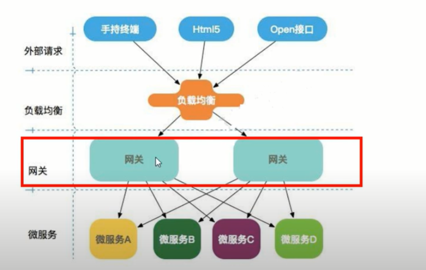
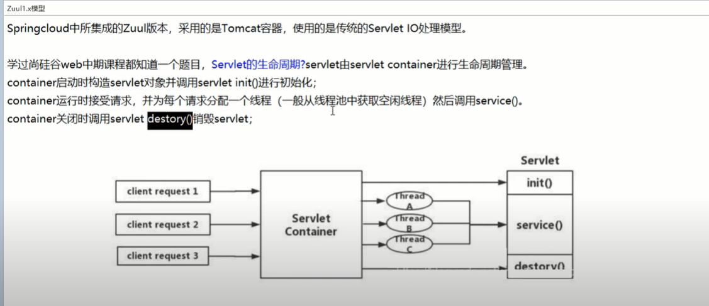
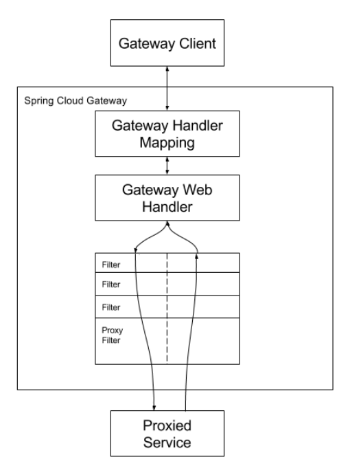

# Gateway demo

## 基本概念
网关在微服务架构处于的角色




gateway能做什么？

异步非阻塞Reactor
反向代理、鉴权、流量控制、熔断、日志监控等等。。。

zuul网关
传统的tomcat容器、基于Servlet IO处理模式；


gateway三大核心概念
- 路由（Router）
构建网关的基本模块，它由ID,目标URL，一系列断言和过滤器组成，如果断言为true，则匹配该路由。
- 断言（Predicate）
参考的是java8中（java.util.function.Predicate）
开发人员可以匹配HTTP请求中的所有内容（例如请求头和请求参数），如果请求与断言规则匹配则进行路由；断言就是我们的匹配条件。
- 过滤器（Filter）
使用Spring框架中GatewayFilter的实例，使用过滤器，可以在请求被路由前或后对请求进行修改；

Gateway的核心工作流程：
客户端向Gateway发起请求，然后在Gateway Handler Mapping 中找到与请求匹配的路由，将其发送到Gateway web handler.
handler再通过指定的过滤器链来将请求发送到我们实际的服务进行逻辑处理，然后返回。
过滤器之间用虚线分开，是因为过滤器可能会在发送代理请求之前（“pre”）或之后（“post”）执行业务逻辑。

Filter在“pre”类型的过滤器实例中做参数校验、权限校验、流量监控、日志输出、协议转换等。
在“post”类型的过滤器实例中可以做响应内容、响应头的修改，日志的输出，流量监控等有着非常重要的作用。



## 初级

- 动态路由：能够匹配任何请求属性
- 可以对路由制定 Predicate(断言) 和 Filter(过滤器)
- 集成Hystrix的断路器功能；
- 集成Spring Cloud服务发现功能
- 易于编写的 Predicate(断言) 和 Filter(过滤器)；
- 请求限流功能；
- 支持路径重写


### 注意要点

#### 网关路由配置

- yml文件配置
  ```
    spring:
      application:
        name: cloud-gateway
      cloud:
        gateway:
          routes:
            - id: swagger_demo_get_route
              uri: http://swager-service:8088
              predicates:
                - Path=/demo/**
  ```
- 代码注入RouteLocator的bean
  ```
    @Configuration
    public class GatewayConfig {
        @Bean
        public RouteLocator routes(RouteLocatorBuilder builder){
            RouteLocatorBuilder.Builder rb = builder.routes();
            rb.route("route_id", r -> r.path("/route/**").uri("http://127.0.0.1:8088/route")).build();
            return rb.build();
        }
    }
  ```
  
## 进阶
### 动态路由
